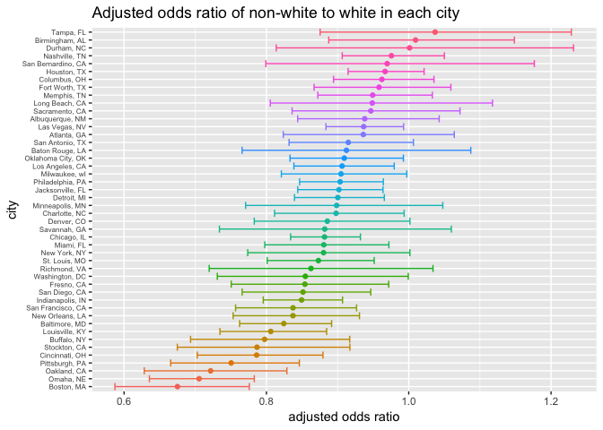

p8105\_hw6\_tt2714
================
Tiffany Tu
11/19/2018

## Problem 1

#### Data cleaning…

A city\_state variable is created to combine the two columns city and
state. Four cities that do not report victim race are removed.
Disposition, victim\_race, and victim\_sex columns are coded into binary
variables.

``` r
homicide = read_csv(file = "./homicide-data.csv") 
homicide_citystate = homicide %>% 
  unite(city_state, c(city, state), sep = ", ", remove = T) %>% 
  filter(!grepl('Dallas|Phoenix|Kansas City|Tulsa', city_state)) %>% 
  mutate(disposition = ifelse(disposition == "Closed by arrest", 1, 0),
         victim_race = ifelse(victim_race == "White", "white", "non-white")) %>% 
  mutate(victim_age = as.numeric(victim_age), 
         victim_sex = as.factor(victim_sex),
         victim_race = fct_relevel(victim_race, "white")) 
```

#### Logistic Regression Model for Baltimore, MD

Outcome: disposition of homicide  
Reference group: race - white  
Predictors: sex and age

Use `broom::tidy` to clean up the model and include odds ratio with
confidence intervals.

``` r
baltimore = homicide_citystate %>% filter(city_state == "Baltimore, MD")
baltimore_glm = glm(disposition ~ victim_race + victim_age + victim_sex, 
                    data = baltimore, family = binomial())

baltimore_glm %>% 
  broom::tidy(., conf.int = TRUE) %>% 
  mutate(odds.ratio = exp(estimate),
         conf.low = exp(conf.low),
         conf.high = exp(conf.high)) %>% 
  kable(digits = 3)
```

| term                  | estimate | std.error | statistic | p.value | conf.low | conf.high | odds.ratio |
| :-------------------- | -------: | --------: | --------: | ------: | -------: | --------: | ---------: |
| (Intercept)           |    1.186 |     0.235 |     5.055 |   0.000 |    2.076 |     5.212 |      3.274 |
| victim\_racenon-white |  \-0.820 |     0.175 |   \-4.694 |   0.000 |    0.312 |     0.620 |      0.441 |
| victim\_age           |  \-0.007 |     0.003 |   \-2.142 |   0.032 |    0.987 |     0.999 |      0.993 |
| victim\_sexMale       |  \-0.888 |     0.136 |   \-6.525 |   0.000 |    0.315 |     0.537 |      0.412 |

#### Regression on all cities

Logistic regression on all cities with odds ratio and confidence
intervals.

``` r
cities_glm = homicide_citystate %>% 
  group_by(city_state) %>% 
  nest() %>% 
  mutate(models = map(data, ~glm(disposition ~ victim_race + victim_age + victim_sex, data = .x)),
         models = map(models, broom::tidy)) %>% 
  dplyr::select(-data) %>% 
  unnest() %>% 
  mutate(odds.ratio = exp(estimate),
         conf.low = exp(estimate - std.error * 1.96),
         conf.high = exp(estimate + std.error * 1.96)) %>% 
  filter(term == "victim_racenon-white")
```

``` r
cities_glm %>% ggplot(aes(color = reorder(city_state, odds.ratio))) +
  geom_point(aes(x = reorder(city_state, odds.ratio), y = odds.ratio)) +
  geom_errorbar(aes(x = city_state, ymin = conf.low, ymax = conf.high)) +
  coord_flip() + ggtitle("Adjusted odds ratio of non-white to white in each city") +
  xlab("city") + ylab("adjusted odds ratio") + 
  theme(axis.text.y = element_text(size = 6), legend.position = "none") 
```

<!-- --> \*
comment on plot

## Problem 2

``` r
birthweight = read_csv(file = "./birthweight.csv")
birthweight_new = birthweight %>% 
  mutate(babysex = as.factor(babysex),
         frace = as.factor(frace),
         mrace = as.factor(mrace),
         malform = as.factor(malform))
```

This dataset consists of 20 variables on a child’s birthweight. There is
a total of 4342 entries of children data. The data is prepared for
regression analysis with appropriate format and no missing data.

#### Regression Model for Birthweight

I am using a step-wise regression (backward direction) for variable
selection, as we have 19 variables available for birthweight prediction.

``` r
model_1 = lm(bwt ~ ., data = birthweight_new)
stepwise_1 = step(model_1, direction = 'backward') %>% 
  broom::tidy()
```

``` r
stepwise_1 %>% kable()
```

| term        |       estimate |   std.error |   statistic |   p.value |
| :---------- | -------------: | ----------: | ----------: | --------: |
| (Intercept) | \-6098.8219113 | 137.5463421 | \-44.340124 | 0.0000000 |
| babysex2    |     28.5580171 |   8.4548958 |    3.377690 | 0.0007374 |
| bhead       |    130.7770408 |   3.4465672 |   37.944144 | 0.0000000 |
| blength     |     74.9471109 |   2.0190479 |   37.120027 | 0.0000000 |
| delwt       |      4.1067316 |   0.3920592 |   10.474775 | 0.0000000 |
| fincome     |      0.3180229 |   0.1747477 |    1.819898 | 0.0688436 |
| gaweeks     |     11.5924873 |   1.4620657 |    7.928842 | 0.0000000 |
| mheight     |      6.5940377 |   1.7848817 |    3.694383 | 0.0002231 |
| mrace2      |  \-138.7924801 |   9.9070869 | \-14.009414 | 0.0000000 |
| mrace3      |   \-74.8867755 |  42.3146313 |  \-1.769761 | 0.0768374 |
| mrace4      |  \-100.6781427 |  19.3246910 |  \-5.209819 | 0.0000002 |
| parity      |     96.3046933 |  40.3362158 |    2.387549 | 0.0170038 |
| ppwt        |    \-2.6755853 |   0.4273585 |  \-6.260752 | 0.0000000 |
| smoken      |    \-4.8434197 |   0.5855757 |  \-8.271210 | 0.0000000 |

This results in 13 correlated predictors for birthweight. But because
this is still a lot of predictors to be considered, I select the top
four with highest coefficients: `babysex`, `blength`, `parity`, and
`bhead`.

``` r
model_1regression = lm(bwt ~ babysex + blength + parity + bhead, data = birthweight_new ) %>% broom::tidy()
model_1regression %>% kable()
```

| term        |     estimate | std.error |   statistic |   p.value |
| :---------- | -----------: | --------: | ----------: | --------: |
| (Intercept) | \-6125.32127 | 97.640184 | \-62.733610 | 0.0000000 |
| babysex2    |     40.77914 |  8.886901 |    4.588680 | 0.0000046 |
| blength     |     85.10775 |  2.071517 |   41.084748 | 0.0000000 |
| parity      |     73.65183 | 42.568284 |    1.730204 | 0.0836649 |
| bhead       |    148.15555 |  3.511124 |   42.196043 | 0.0000000 |

#### Additional Models

Predictors: length at birth and gestational age

Head circumference, length, sex and all

#### Comparing Models

Comparing my model with cross-validation prediction error
